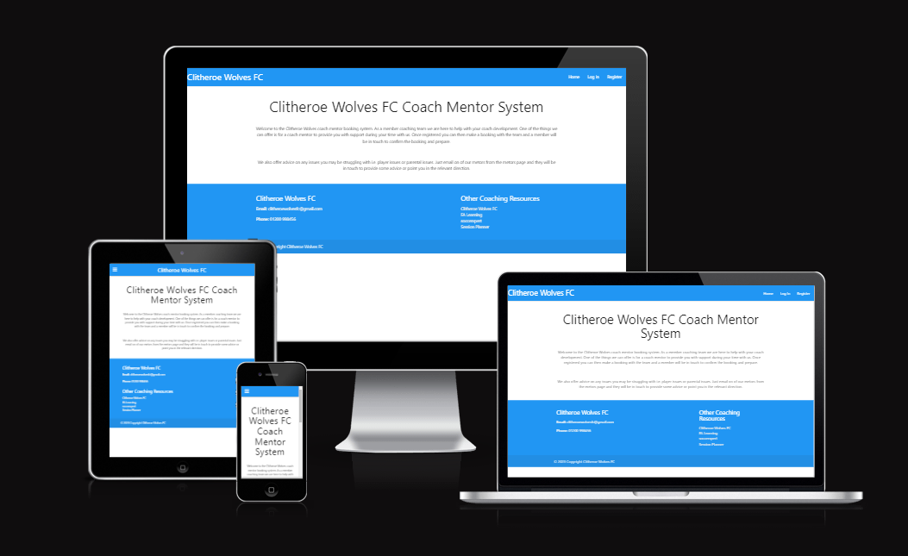

# Clitheroe Wolves Coach Mentor System

## Code institute / City of Bristol College Milestone Project 3

*Created using* [Am I Responsive](http://ami.responsivedesign.is/)

Clitheroe Wolves Coach Mentoring system is something that Clitheore Wolves FC will use with their new coaches in order for them to get the help and support they need from experienced coaches within the club. This is my third milestone project for the full stack development course at Code Institute / City of Bristol College. For this project I had to create a full-stack site that allows your users to manage a common dataset about a particular domain. This was to include the use of Flask framework.

Click <a href="https://clitheroe-coach-mentor.herokuapp.com/">here</a> to view the live website.

## User Experince 
In this section, I will be providing information on the UX process. Focusing on who the PeakMotion website is for, the main aims of this project and how the website helps to meet the users needs

The Project Goals:
<ul>
    <li>Allow users to register an account</li>
    <li>Enable users to make a booking </li>
    <li>Alow users the ability to change a booking created</li>
    <li>Provide information and the current club mentors</li>
</ul>

## User stories

A new user:
<ul>
    <li>Easy to sign up</li>
    <li>Easy to make a booking</li>
    <li>Easy to change a booking mate</li>
</ul>

#### Returning users

Current user:
<ul>
    <li>Easy to make a booking</li>
    <li>Easy to change a booking mate</li>
</ul>

Buisness Owner:
<ul>
    <li>Give users the ability to make bookings with the coach mentors</li>
    <li>Show users contact details for the club and coach mentors</li>
    <li>Provide other learning resources</li>
</ul>

## User Centered Design
### 1. Strategy Plane
The User Centered Design process started with the creation of the user stories and these influenced the design and layout of the product.

### 2. Scope Plane
A system so the club can allow its new coaches to book time with one of the experienced coach metors to help them with any issues or just to improve them as coaches.

### 3. Structure Plane
After idenifying the needs of the business owner and users that will use the new system the below was identified as required:
<ul>
    <li>Blue and White colour scheme to match the clubs current colours</li>
    <li>Club contact details/li>
    <li>Current club mentors</li>
    <li>Booking form</li>
    <li>User bookings page</li>
    <li>Clear layout</li>
    <li>easy navigation for the user</li>
</ul>

### 4. Skeleton Page
To create the wireframes for the product I used <a href="https://www.figma.com/>">Figma</a>. They were created to appear as they would on a desktop, table and mobile.

We have a header containing the logo and nav bar.

To help the website with responsiveness of devices it was decided that when viewed on a tablet or mobile that the nav bar would be in a drop down hamberger menu.

A footer is also included which contains the opening hours, address, contact number and socail media links.

#### Wireframes
Desktop:
<ul>
    <li><a href="documentation/wireframe/Desktop-Home-page.png">Index Page</a></li>
    <li><a href="documentation/wireframe/Desktop-Log-In.png">Log In Page</a></li>
    <li><a href="documentation/wireframe/Desktop-Make-a-Booking.png">Make a Booking Page</a></li>
    <li><a href="documentation/wireframe/Desktop-Mentors.png">Mentors Page</a></li>
    <li><a href="documentation/wireframe/Desktop-User-bookings.png">User Bookings page</a></li>
    <li><a href="documentation/wireframe/Desktop-User-Profile.png">User Profile Page</a></li>
</ul>

Tablet:
<ul>
    <li><a href="documentation/wireframe/Tablet-Home-Page.png">Index Page</a></li>
    <li><a href="documentation/wireframe/Tablet-Log-In.png">Log In Page</a></li>
    <li><a href="documentation/wireframe/Tablet-Make-a-Booking.png">Make a Booking Page</a></li>
    <li><a href="documentation/wireframe/Tablet-Mentors.png">Mentors Page</a></li>
    <li><a href="documentation/wireframe/Tablet-Profile.png">User Profile Page</a></li>
    <li><a href="documentation/wireframe/Tablet-user-bookings-page.png">User Bookings Page</a></li>
</ul>

Mobile:
<ul>
    <li><a href="documentation/wireframe/Phone-home.png">Index Page</a></li>
    <li><a href="documentation/wireframe/Phone-log-in.png">Log In Page</a></li>
    <li><a href="documentation/wireframe/Phone-Make-a-Booking.png">Make a Booking Page</a></li>
    <li><a href="documentation/wireframe/Phone-mentorss.png">Mentors Page</a></li>
    <li><a href="documentation/wireframe/Phone-User-bookings-Page.png">User Bookings Page</a></li>
    <li><a href="documentation/wireframe/Phone-User-Profile-Page.png">User Profile Page</a></li>
</ul>
